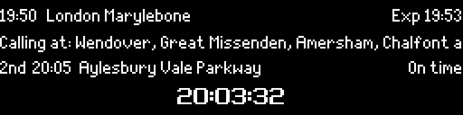

# 🚂 Pico train departure display 🚂

A MicroPython-based application for displaying near-realtime UK railway
departure times. It is designed to run on a
[Raspberry Pi Pico W](https://www.raspberrypi.com/products/raspberry-pi-pico/)
microcontroller, with an SSD1322-based 256x64 OLED display, driven over its
8080 8-bit parallel interface.

This project uses the
[Realtime Trains API](https://api-portal.rtt.io/) as its data source,
and is heavily inspired by [several other projects](#credits).

The layout copies a real National Rail platform indicator, down to the row
geometry: four rows of nine pixels, text using seven of them with two for
descenders, and the clock, which has none, filling all nine.

| A real platform indicator | This display |
|---|---|
|  |  |

Both are real: the right-hand board is a genuine Chiltern Railways morning
from Stoke Mandeville, calling points and all, exactly as the API returned it,
in the amber the panel actually glows.

How that was measured, and what it means for the fonts, is in
[docs/display-format.md](docs/display-format.md).

## Introduction

The goal of this project is to display a live departure board for a station,
showing trains departing for a specific destination. It's written entirely in
Python and should be able to run on any microcontroller that is capable of
running MicroPython.

It's been extensively tested on a
[Raspberry Pi Pico W](https://www.raspberrypi.com/products/raspberry-pi-pico/),
which was challenging due to its limited RAM, and with an SSD1322-based display.

## Building your own display

> TODO: Add steps on how to build the display from scratch!

## Installation

The easiest way is to install the Pico Train Dispaly software is to download the
pre-built image from the
[latest release](https://github.com/ben-to-go/pico_train_display/releases/latest).
Both the Pico W and the Pico 2 W are supported. To install:

1. Press and hold down the BOOTSEL button while you connect the other end of the
   micro-USB cable to your computer. This will put the Raspberry Pi Pico into
   USB mass storage device mode.
1. Copy the downloaded file for your board to the mounted device:
   [`pico_train_display_RPI_PICO_W.uf2`](https://github.com/ben-to-go/pico_train_display/releases/latest/download/pico_train_display_RPI_PICO_W.uf2)
   for a Pico W, or
   [`pico_train_display_RPI_PICO2_W.uf2`](https://github.com/ben-to-go/pico_train_display/releases/latest/download/pico_train_display_RPI_PICO2_W.uf2)
   for a Pico 2 W. The two are not interchangeable: each carries a UF2 family
   the other board's bootloader ignores. Once complete, the device should
   automatically disconnect.
1. Connect the Raspberry Pi Pico to a power supply. The display should now show
   a welcome message with details on how to connect to the setup website.
1. Follow the on-screen instructions. Once the settings are saved, the device
   should automatically restart.

You should now have a fully configured Pico-powered train display!

### Reset settings

Settings are stored in flash memory as a JSON file called `config.json`. To
reset all settings, simply delete this file. One easy way to do this is to reset
the entire flash memory, which can be done by following the official
[resetting flash memory](https://www.raspberrypi.com/documentation/microcontrollers/raspberry-pi-pico.html#resetting-flash-memory)
instructions. Once flashed, you'll need to re-install the software again.

## Credits

Firstly, a massive thank you to [Dave Ingram](https://github.com/dingram) for
inspiring me to work on this project in the first place, and helping me with the
hardware and low-level driver software!

Thanks also goes to various other incantations of this project, namely
[Chris Crocker-White](https://github.com/chrisys/train-departure-display),
[Chris Hutchinson](https://github.com/chrishutchinson/train-departure-screen),
and of course [Dave](https://github.com/dingram/uk-train-display).

Also a big thank you to the wonderful folk at
[Realtime Trains](https://www.realtimetrains.co.uk/) for providing a brilliant
API for train departures.

The photograph of a real indicator above is from
[balena's write-up](https://blog.balena.io/) of Chris Crocker-White's build.

Finally thank you to Daniel Hart who created the wonderful
[Dot Matrix](https://github.com/DanielHartUK/Dot-Matrix-Typeface) type face, and
Peter Hinch for his
[font-to-python](https://github.com/peterhinch/micropython-font-to-py) tool,
which saved my sanity.
