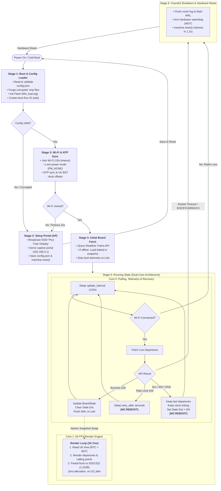

# Application Execution Lifecycle & Features

This document explains what happens at every stage of the display's execution lifecycle—from cold boot to captive provisioning, dual-core rendering, runtime error recovery, and hardware reset—and details all the features and transition paths active at each step.

---

## 🗺️ Complete Execution Lifecycle & Architecture Flowchart

The following interactive diagram maps all lifecycle stages, decision points, cross-core concurrency, and hardware recovery loops:

---

## Stage-by-Stage Feature Breakdown

### Stage 1: Cold Boot & Configuration Discovery

When power is applied to the Pico 2 W, `main.main()` executes on **Core 0**:

| Feature | Where | What it does | Conditional Paths |
| :--- | :--- | :--- | :--- |
| **Config Loader & Validation** | `src/config.py` | Reads `config.json`, validates types and value bounds. | • **Invalid / Missing**: Diverts to **Stage 2 (Setup Portal)**. • **Valid**: Proceeds to **Stage 3 (Wi-Fi & Time Sync)**. |
| **Baked-in Build Tokens** | `src/baked.py` | Allows pre-embedding `RTT_TOKEN` or `OTEL_HEADERS` into firmware so devices can be gifted without manual credential entry. | Loaded if `config.json` does not specify tokens. |
| **Flash Write-Ahead Log (WAL)** | `src/wal.py` | Mounts flash filesystem, auto-purges corrupted/orphaned `.tmp` files, and prepares `wal.log` for persistent logging. | Always initialized at startup. |
| **Observability Initialization** | `src/otel.py` | Configures OpenTelemetry exporter, creates a unique boot Run ID, and records startup memory capacity. See [docs/observability.md](observability.md). | Always executed at boot. |

---

### Stage 2: Provisioning & Captive Portal (`setup`)

If `config.json` is missing or unreadable, or if Wi-Fi cannot connect at startup, the board enters configuration mode:

| Feature | Where | What it does | Conditional Paths |
| :--- | :--- | :--- | :--- |
| **OLED Status Display** | `src/widgets.py` | Drives the SSD1322 screen to display the setup SSID (`Pico Train Display`), password (`12345678`), and URL (`http://192.168.4.1`). | Displayed continuously while AP is active. |
| **Live SSID Discovery** | `src/services/wifi.py` | Scans nearby Wi-Fi networks in the background, sorts by signal strength (RSSI), and deduplicates mesh network nodes sharing the same SSID. | Populates drop-down list in the setup portal. |
| **Async Web Server** | `src/setup/server.py` | Serves an interactive mobile-friendly web page allowing the user to select their Wi-Fi, enter their password, and pick their home/destination stations. | Waits for user form submission. |
| **Clean Connection Teardown** | `src/setup/server.py` | Flushes the HTTP 200 response to the browser, pauses for client disassociation, deactivates the AP, writes `config.json`, and calls `machine.reset()`. | **Reboots hardware** $\rightarrow$ loops back to **[POWER ON / COLD BOOT] $\rightarrow$ Stage 1**. |

---

### Stage 3: Network Connection & Time Synchronization

Once valid configuration is loaded, `main.run()` establishes network connectivity:

| Feature | Where | What it does | Conditional Paths |
| :--- | :--- | :--- | :--- |
| **Wi-Fi Association** | `src/services/wifi.py` | Connects to the configured SSID with a 15-second timeout and animates connection progress dots on the OLED display. | • **Fails (timeout / wrong credentials)**: Raises `_NeedsSetup()` $\rightarrow$ diverts to **Stage 2 (Setup Portal)**. • **Succeeds**: Proceeds to NTP time sync. |
| **Power Management Lockdown (`PM_NONE`)** | `src/services/wifi.py` | Forces `wlan.config(pm=0xa11140)` on every connection to stop the CYW43 Wi-Fi chip from entering DTIM sleep between router beacons (preventing ~90% of radio drops). | Enforced on every Wi-Fi association. |
| **NTP Network Time Sync** | `src/services/ntp.py` | Synchronizes the RP2350 hardware RTC to UTC via standard Network Time Protocol servers. | • **Fails**: Logs warning, leaves clock unset (retried on next loop cycle). • **Succeeds**: Clock locked to UTC. |
| **UK Daylight Saving Time Rules** | `src/utils.py` | Computes British Summer Time (BST) offsets automatically so the clock matches real-world platform clocks year-round. | Applied dynamically during every render pass. |

---

### Stage 4: Initial Departure Fetch & Fallback Safety

Before launching the display render engine, the system fetches the first set of live train departures:

| Feature | Where | What it does | Conditional Paths |
| :--- | :--- | :--- | :--- |
| **Synchronous First Fetch** | `src/trains.py` | Contacts Realtime Trains to retrieve initial departures and calling points. | • **Succeeds**: Live departures stored in initial `BoardState`. • **Fails**: Falls back to baked-in timetable snapshot. |
| **Baked-In Snapshot Fallback** | `src/fallback.py` | If the network or API fails on initial boot, immediately loads a pre-captured real-world weekday morning timetable (Stoke Mandeville to London Marylebone) so the screen is never blank. See [docs/fallback.md](fallback.md). | Activated if no live fetch has ever succeeded. |
| **Boot Telemetry Delivery** | `src/otel.py` | Flushes startup and memory logs to Grafana Cloud Loki before entering the main loop. | Sent immediately before spawning render thread. |

---

### Stage 5: The Running State (Dual-Core Engine & Non-Fatal Recovery)

`main.run()` orchestrates steady-state execution across both CPU cores:

#### Core 1: Dedicated 60 FPS Render Engine
| Feature | Where | What it does | Conditional Paths |
| :--- | :--- | :--- | :--- |
| **Dual-Core State Isolation** | `src/state.py` | Uses atomic snapshot swapping (`StateController`) so Core 1 draws immutable copies of board data without lock contention with Core 0. | Core 1 never waits or blocks on network calls. |
| **8080 8-Bit Parallel Bus** | `src/parallel8080.py` | Bit-bangs the 256x64 SSD1322 OLED over an 8-bit parallel bus using MicroPython `viper` assembly, matching hardware timing requirements ($\ge 300\text{ns}$ cycle, $\ge 60\text{ns}$ strobe pulse). | Runs every 16.7 ms (60 Hz). |
| **Partial Row Flushing** | `src/ssd1322.py` | Compares previous and current framebuffers and transmits **only modified row spans** (e.g. 9 rows = 1,152 bytes vs 8,192 bytes full frame), reducing bus traffic by **86%** and eliminating visual tearing. | Only modified row spans are pushed to hardware. |
| **Zero-Allocation Rendering** | `src/widgets.py` | All framebuffers, command arrays, and row buffers are pre-allocated. Eliminates per-frame `gc.collect()` in the render thread for stutter-free 60 FPS output. | Zero garbage collection overhead on Core 1. |
| **Smooth Text Scrolling** | `src/widgets.py` | Scrolls long calling-point lists using precise microsecond clock offsets rather than frame-step increments for buttery-smooth motion. | Continuous sub-pixel text scrolling. |
| **Authentic Rail Typography** | `src/fonts.py` | Draws departures using a faithful dot-matrix typeface with destination, scheduled time, expected time, platform badges, and ticking seconds indicator. See [docs/display-format.md](display-format.md). | Redrawn every frame. |

#### Core 0: Scheduled Polling & Runtime Recovery
| Feature | Where | What it does | Conditional Paths |
| :--- | :--- | :--- | :--- |
| **Request Budgeting (120s Pace)** | `src/main.py` | Polls Realtime Trains every 120 seconds (32 requests/hour), staying well inside the 100 req/hr and 1,000 req/day API rate limits. | Normal steady-state cadence. |
| **Dynamic Calling Points** | `src/services/rtt.py` | Detects when the next departing train changes and automatically fetches its full calling points. | Triggered on top train service change. |
| **401 Token Auto-Renewal** | `src/services/rtt.py` | Automatically exchanges expired OAuth/access tokens in <1 second without interrupting display output. | Handled inline on HTTP 401. |
| **429 Rate Limit Backoff** | `src/main.py` | Automatically backs off for `error.retry_after` seconds without rebooting or spamming the server. | **Non-Fatal**: Sleeps for backoff, repeats loop. |
| **API Outage Resilience (5xx/404/DNS)** | `src/main.py` | If Realtime Trains is down or DNS fails while Wi-Fi is connected, the board **does not reboot**. The clock keeps ticking, the last valid departures stay visible, and the **1-pixel Stale Dot** illuminates. Details in [docs/fallback.md](fallback.md). | **Non-Fatal**: Sets stale dot, waits 120s, repeats loop. |
| **Persistent WAL Replay** | `src/otel.py` | Replays any offline back-buffered logs from flash memory (`wal.log`) to Grafana Cloud Loki upon reconnection. | Flushed to Loki on every successful cycle. |
| **Heap Memory Monitoring** | `src/main.py` | Tracks free/allocated heap memory (typically ~22% utilized, ~356 KB free) and triggers proactive garbage collection on Core 0 during idle polling windows. | Logged periodically. |

---

### Stage 6: Graceful Shutdown & Hardware Reset

When an unrecoverable radio error occurs (such as the CYW43 Wi-Fi chip locking up with `STAT_CONNECTING`, `EHOSTUNREACH`, or persistent socket timeouts):

| Feature | Where | What it does | Conditional Paths |
| :--- | :--- | :--- | :--- |
| **Fast Radio Loss Detection** | `src/main.py` | Detects link loss or hardware socket failure and raises `_RadioIsGone` immediately, bypassing futile software reconnects. | **Fatal**: Exits running loop into shutdown handler. |
| **Shutdown Watchdog** | `src/main._arm_shutdown_watchdog` | Arms a hardware watchdog timer (`machine.WDT`) to guarantee that the chip resets even if network socket cleanup hangs. | Arms 5-second hardware timer. |
| **Flash WAL Flush** | `src/wal.py`, `src/otel.py` | Writes any unsent log entries to flash memory so crash reasons and stack traces survive the reboot. | Flushes `wal.log` to flash. |
| **Fast 1.2s Hardware Reset** | `src/main.main` `finally` | Calls `machine.reset()`, power-cycling the RP2350 CPU and CYW43 radio registers and returning the board to full operation in **~10 seconds**. | **Loops back to [POWER ON / COLD BOOT] $\rightarrow$ Stage 1**. |
